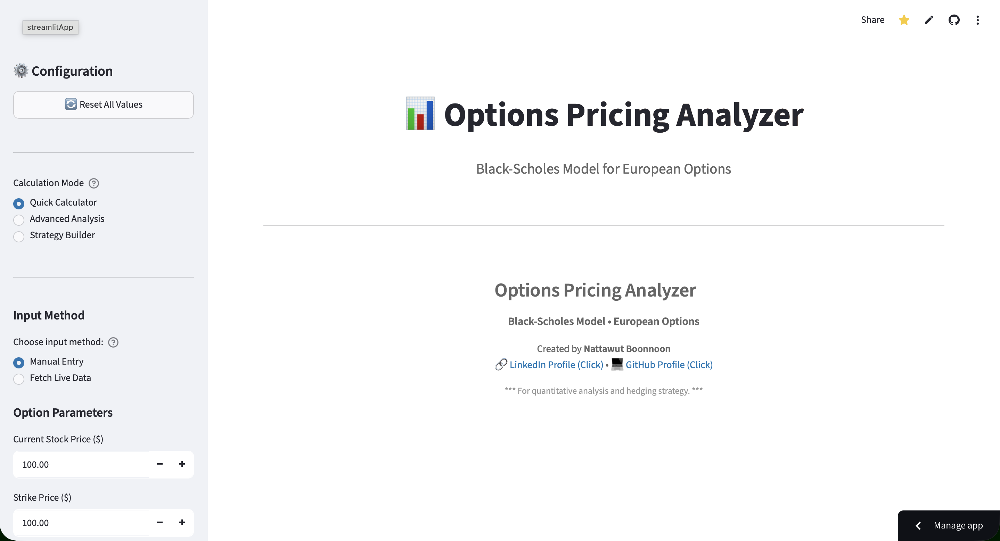
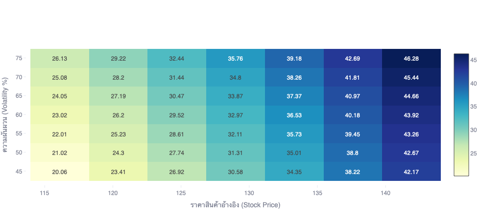

# <p align="center"> Python: Black-Scholes Implied Volatility <p/>
<br>**Nattawut Boonnoon**<br/>
- LinkedIn: www.linkedin.com/in/nattawut-bn
- Email: nattawut.boonnoon@hotmail.com

***Overview***
- 
[](https://github.com/Nattawut30/Black-Scholes-Implied-Volatility-Python/actions) <br>
Here: https://nattawut-black-sholes-op.streamlit.app// <br>


This is my options pricing models analysis that combines educational clarity with real-world utility. It uses the Black-Scholes model to price European options and includes advanced features like implied volatility calculation, strategy analysis, and live market data integration. Built with Python and Streamlit, it serves both learning and practical analysis.




# <p align="center">What is Black-Scholes pricing model? <p/>
The Black-Scholes, or Black-Scholes-Merton model is a mathematical model that describes the trends of a financial market, including derivative investment instruments. The formula and model are named after the economists *Fischer Black* and *Myron Scholes*. Occasionally, attribution is also awarded to *Robert C. Merton*, who was the first to write an academic paper on the topic.

The model's fundamental objective is to hedge the option by purchasing and selling the underlying asset in a precise pattern to remove risk. This type of hedging is known as "constantly modified delta hedging" and forms the foundation of more complex hedging strategies utilized by investment firms and hedge funds.

Call Options Price:
`````bash
C = S₀·N(d₁) - K·e^(-rT)·N(d₂)
`````
Put Options Price:
`````bash
P = K·e^(-rT)·N(-d₂) - S₀·N(-d₁)
`````
Where:
`````bash
d₁ = [ln(S₀/K) + (r - q + σ²/2)T] / (σ√T)
d₂ = d₁ - σ√T
`````
Parameters:

S₀ = Current stock price <br>
K = Strike price <br>
T = Time to expiration (years) <br>
r = Risk-free interest rate <br>
σ = Volatility (annual) <br>
N(x) = Cumulative normal distribution <br>

# <p align="center">Acknowledgments<p/>

**Dependencies:**
- `streamlit` - Web app framework
- `pandas` - Data manipulation
- `numpy` - Numerical calculations
- `scipy` - Statistical functions
- `plotly` - Interactive charts
- `yfinance` - Fetching data

**Academic Papers:**
- Black, F., & Scholes, M. (1973). *"The Pricing of Options and Corporate Liabilities"*
- Merton, R. C. (1973). *"Theory of Rational Option Pricing"*
